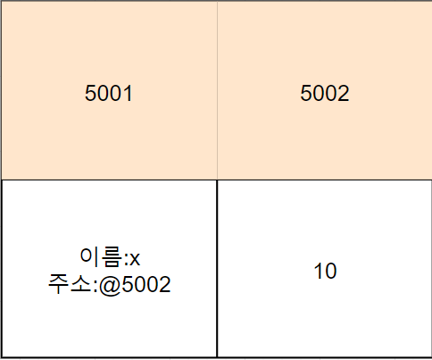
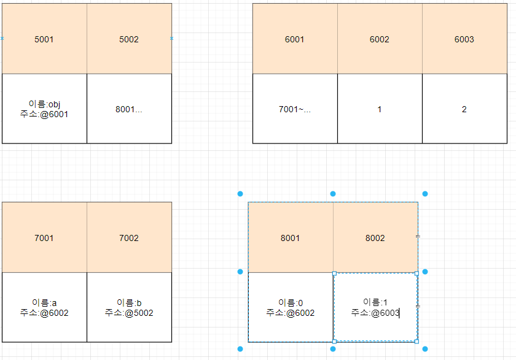
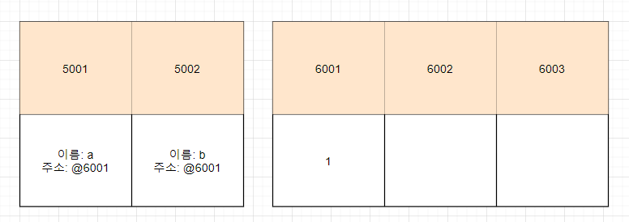
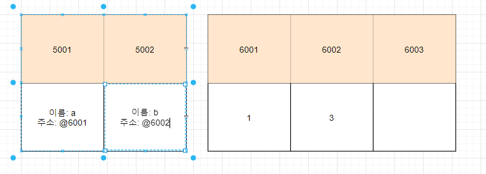
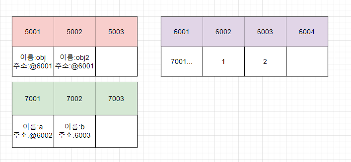
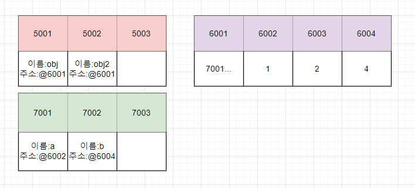
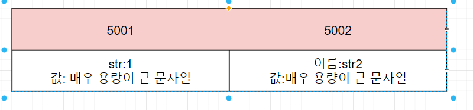

primitive type

reference type

stack memory (변수 기본형 데이터 정적할당)

heap memory(참조형 데이터 동적 할당)

변수를 선언하면 메모리를 확보하여 이름을 지정하고 값을 저장하고 읽는다.

변수에 들어 있는 값은 임의의 메모리에 값을 저장한후 메모리 주소 값을 저장해준다.

이후 값이 바뀌면 또 새로운 메모리에 지정하고 a를 검색한다.

참조형은

# 자바스크립트에서 메모리를 다루는 방법

## 기본형 데이터 다루기

```js
const x = 10; // 기본형
```



1 위 도표처럼 먼저 값을 임의의 메모리에 저장한다(5002)  
2 새로운 메모리에 식별자와 주소를 지정한다.

## 참조형 데이터 다루기

```js

// 참조형
const obj = {
    a: 1
    b: [1, 2]
}
```



위 그림과 코드를 살펴보자 obj 객체는 프로퍼티 a와 프로퍼티 b를 가지고 있으며 a는 기본형이고 b는 참조형이다.

참조형은 메모리에 값을 한번에 저장할 수 없기 때문에 여유 메모리 공간을 확보한다. 그리고 프로퍼티를 가르키는 메모리 주소를 저장해 놓는다(6001).

프로퍼티의 값을 가르키는 메모리에 저장할 값을 임의의 메모리에 만든다 (6002).  
프로퍼티의 식별자와 주소를 넣어준다.(7001)

다음에 다시 참조형 프로퍼티를 가지므로 또 메모리 주소의 모임에대한 정보를 저장한 메모리를 만든다(5002).  
그다음에 메모리에 저장할 값들을 다시 메모리를 확보하여 저장 하여야 한다. 이때 1이란 값은 이미 존재하고 있으므로 6002의 값을 재사용한다. 그리고 새로운 메모리에 2 값을 할당한다(6003) 그리고 나서 8001과 8002에 각각 이름과 주소를 저장한다.

# 값의 불변성

위 예제의 흐름을 이해했다면 기본형 값은 메모리에 1개만 존재해야 한다는 사실을 이해할 수 있을 것이다.
메모리 내부에서 동일한 값들은 재사용 된다.

# 기본형과 참조형의 변경 차이

## 기본형

```js
let a = 1;
let b = a; // 1

b = 3; // 2
```



위 코드 1의 실행 흐름에서 6001 에 값을 생성하고 5001에 주소를 넣어준 뒤, 새로 만든 변수 b에 a가 가르키고 있는 주소를 넣어 준다.



2의 실행흐름에서 3이라는 값이 들어갈 메모리 공간을 확보하고 변수 b의 주소를 바꿔준다.

## 참조형

```js
const obj = {
    a = 1,
    b = 2
}

const obj2 = obj; // 1

obj2.a = 4; // 2
```



위의 글이 있으므로 여기서는 설명을 좀 줄인다.

7001~7003은 참조형 프로퍼티의 값을 저장하기 위한 메모리 집단이다.  
참조형의 주소는 6001이며 메모리집단의 주소를 가지고 있다.

5001 5002 즉 obj와 obj2는 동일한 메모리 집단을 가르키는 주소를 가르키게 된다.

여기까지가 1번의 흐름이다.



2번에서 값이 바뀔때 메모리 집단의 7002의 b가 가르키는 주소만 바뀔 뿐 obj와 obj2는 동일한 메모리 집단을 가르키고 있다. 따라서 다른 식별자로 값을 변경해도 동일한 주소를 가르키고 있다는 것이다.

# 값 대신에 메모리 주소를 저장하는 이유

## 만일 값을 저장한다면?

```js
const str1 = "매우 용랑이 큰 문자열";

const str2 = "매우 용량이 큰 문자열";
```



저런 데이터들을 값을 할당할 때 마다 메모리에 저장한다면 매우 비효율 적이기 때문에, 또 그런일이 빈번히 일어나기 때문에 주소를 저장하는 방식이 더 효율적이다.
